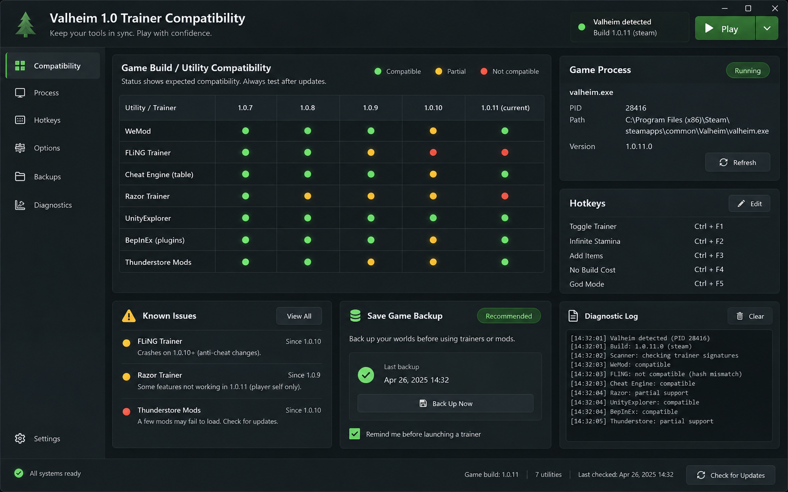

# Valheim トレーナー対応情報・ホットキー資料

ゲームとトレーナーの版、キー割り当てを整理。独立した参考資料であり、FLiNG公式配布や検証済みトレーナーではありません。

<a href="./README.md">English</a> · <a href="./README_ES.md">Español</a> · <a href="./README_PT.md">Português</a> · <a href="./README_DE.md">Deutsch</a> · <a href="./README_FR.md">Français</a> · <a href="./README_CN.md">简&#8288;体&#8288;中&#8288;文</a> · <a href="./README_TW.md">繁&#8288;體&#8288;中&#8288;文</a> · <a href="./README_JP.md">日&#8288;本&#8288;語</a> · <a href="./README_KR.md">한&#8288;국&#8288;어</a>

  

## このツールが必要な理由

ゲームとトレーナーの版、キー割り当てを整理。独立した参考資料であり、FLiNG公式配布や検証済みトレーナーではありません。

現在のリポジトリは文書と画面のコンセプトを収録しており、動作するリリースは未確認です。説明や画像は実行テストでも、公式性・対応版・アカウント保護の証明でもありません。

## 開始前の準備

- **ゲームビルド + トレーナービルド** を用意し、対象の Valheim プロファイルまたはセッションのものか確認します。
- プロファイルを変更する前に、現在のゲーム／クライアントビルドまたはデータ日付を控えます。
- 前回の結果を上書きしないよう、**診断ログ** の保存先を決めます。
- まず **トレーナーとゲームのバージョンのマトリックス** を短時間だけ試し、元のセーブ、プロファイル、比較結果を残してください。

## できること

### 01 · トレーナーとゲームのバージョンのマトリックス

トレーナーのリリースを、検出された実行可能ファイルおよびゲーム ビルドと照合します。

### 02 · オプションとホットキーのインデックス

競合を隠すことなく、オプション グループ、現在の状態、ホットキーをリストします。

### 03 · バックアップリマインダーを保存する

添付ファイルとオプションの失敗を、それらを再現するのに十分なコンテキストとともに記録します。

## 画面の見方

- **01.** ゲームとトレーナーのバージョンの互換性マトリックス。
- **02.** 実行可能ファイルと特権ステータスを含むプロセス検出カード。
- **03.** 機能ごとにグループ化されたオプションのインデックス。
- **04.** 競合警告を含むホットキー リスト。
- **05.** テスト前の診断ログとバックアップの保存のリマインダー。

## 初回の一連の流れ

1. **Valheim トレーナー対応情報・ホットキー資料** を開き、検出された Valheim のビルドまたはデータ元を確認します。
2. 入力またはプロファイルを選び、今回のテストに関係しない初期値は変えずに **トレーナーとゲームのバージョンのマトリックス** を設定します。
3. プレビューまたはステータス欄で **オプションとホットキーのインデックス** を確認し、バージョン、フィルター、検出の警告を解消します。
4. 操作を一つだけ実行します。二つ目の設定を変える前に、表示結果をプレビューと比較してください。
5. プロファイルまたは結果を保存し、比較や復元に使える **バックアップリマインダーを保存する** を残します。

## 機能の概要

| 機能 | 結果 |
|---|---|
| **入力** | ゲームビルド + トレーナービルド |
| **結果** | 互換性とホットキーのマトリックス |
| **出力** | 診断ログ |

## 結果の読み方

互換性はオプション数より優先されます。ビルドが一致しないプロセスが検出された場合、接続は成功しません。 1 つのオプションを有効にし、シーンの変化を通じてそれを観察し、結果を記録します。このシーケンスにより、ホットキーの競合、一時値、およびサポートされていないポインターが分離されます。

## こんな用途に

- トレーナーとゲームのバージョンを一致させる
- 検索オプションのホットキー
- プロセス検出を診断する

## ゲーム更新後の確認

- [ ] プロセスを検出する前に、ゲームの実行可能ファイルとトレーナーのリリースを比較します。
- [ ] ホットキーをテストする前に、権限と実行可能ファイル名の変更を解決してください。
- [ ] 1 つの可逆オプションを有効にし、シーンのリロードを通じてそれを観察します。
- [ ] 新しいペアリングが確認されるまで、古い診断ログを保管し、バックアップを保存してください。

## トラブルシューティング

> **よくある不具合:** トレーナーが Valheim プロセスを見つけることができません.

### プロセスが見つかりません

実行可能ファイルの名前、特権レベル、およびゲームがサポートされている状態に達しているかどうかを確認します。

### ホットキーは何もしません

重複したバインディングを解決し、選択したトレーナー ビルドがゲームと一致することを確認します。

### オプションはシーン間でオフになります

永続化に関するメモを読み、ゲームが書き換えるオプションとは別にテストしてください。

## データと復元

テスト前に保存をバックアップし、一度に 1 つのオプションを有効にします。クリーンなロールバックのために、ビルド、プロセス、ホットキーの詳細が診断ログに残る必要があります。

自動化や変更機能は、ゲームのルールとセッション形式で許可されている場合にのみ使用してください。

## よくある質問

<strong>対応情報には何を記録しますか？</strong>

正確なゲームビルド、ツール・データの版、入力、観測結果を残してください。不明な項目は不明のまま記録します。画像や別バージョンでの成功は現在の対応を証明しません。

<strong>動作するプログラムやスクリプトは含まれますか？</strong>

現在のリポジトリは文書と画面のコンセプトを収録しており、動作するリリースは未確認です。説明や画像は実行テストでも、公式性・対応版・アカウント保護の証明でもありません。

---

## ダウンロード

バージョンを選ぶ前に、記載された対象範囲と対応状況を確認してください。

---

AIで生成したインターフェースのコンセプト画像です。動作するリリースは未確認です。

